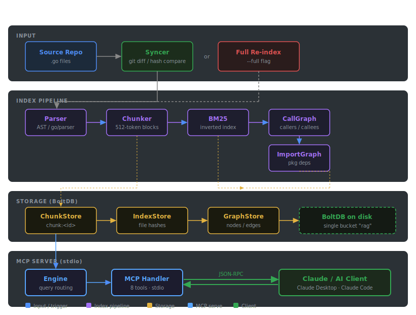

# Smart RAG

RAG-based code intelligence engine with MCP server. Index your codebase and query it via natural language, symbol search, call graph, and impact analysis.

**Supported languages:** Go, JavaScript, TypeScript (including JSX, TSX, ES modules)

## Architecture



## Quick Start

### Auto Installation with AI

Copy the setup guide URL and share with your AI assistant:
```
https://raw.githubusercontent.com/robby031/smart-rag/main/docs/SETUP_PROMPT.md
```

Paste this link to Claude, ChatGPT, or any AI and say:
> "Read this setup guide and help me install smart-rag on my system"

The AI will read the guide and step you through the entire installation process for your device.

---

### Manual Setup

[📖 **Setup Guide for AI Assistants**](docs/SETUP_PROMPT.md) — Step-by-step instructions for all three setup methods.

---

## Usage

### Build

```bash
make build
```

### Run (incremental index + MCP server)

```bash
make run REPO=/path/to/your/project
```

### Run (full re-index)

```bash
make run-full REPO=/path/to/your/project
```

### CLI flags

| Flag       | Default  | Description                         |
| ---------- | -------- | ----------------------------------- |
| `--repo`   | `.`      | Path to the code repository to index |
| `--db`     | `./rag-data` | Path to store the RAG database    |
| `--full`   | `false`  | Force full re-index instead of incremental |
| `--pruning`| `soft`   | Index pruning mode: `off`, `soft`, or `hard` |
| `--version`| `false`  | Show version                        |

### Docker Hub (no build required)

**1. Pull image**

```bash
docker pull robbymangku/smart-rag:latest
```

**2. Index your repo**

```bash
docker run --rm \
  -v "/path/to/your/project:/repo:ro" \
  -v "smart-rag-data:/data" \
  robbymangku/smart-rag:latest --repo=/repo --db=/data --full
```

**3. Add to Claude Desktop** — `~/Library/Application Support/Claude/claude_desktop_config.json`:

```json
{
  "mcpServers": {
    "smart-rag": {
      "command": "docker",
      "args": [
        "run", "-i", "--rm",
        "-v", "/path/to/your/project:/repo:ro",
        "-v", "smart-rag-data:/data",
        "robbymangku/smart-rag:latest"
      ]
    }
  }
}
```

**4. Add to Claude Code** — `.mcp.json` in your project root:

```json
{
  "mcpServers": {
    "smart-rag": {
      "command": "docker",
      "args": [
        "run", "-i", "--rm",
        "-v", "/path/to/your/project:/repo:ro",
        "-v", "smart-rag-data:/data",
        "robbymangku/smart-rag:latest"
      ]
    }
  }
}
```

Restart Claude after adding the config. On each new session, Docker automatically runs an incremental sync before the MCP server starts.

**Update to the latest version:**

```bash
docker pull robbymangku/smart-rag:latest
```

> Also available on GHCR: `ghcr.io/robby031/smart-rag:latest`

---

### Docker (build locally)

**1. Build image**

```bash
make docker-build
```

**2. Index your repo**

```bash
make docker-index REPO=/path/to/your/project
```

**3.** Use the same MCP config as above, replacing the image with `smart-rag:latest`.

**Re-index after updating smart-rag source:**

```bash
make docker-restart REPO=/path/to/your/project
```

---

### Binary (without Docker)

Run `make install` or add to your MCP client config:

```json
{
  "mcpServers": {
    "smart-rag": {
      "command": "rag-mcp",
      "args": ["--repo", "/path/to/your/project"]
    }
  }
}
```

### Available MCP Tools

- `rag_status` — health check for version, index, graph, BM25, paths, and last sync
- `search_code` — ranked BM25 code search with stable tie-breakers and filters
- `find_definition` — go-to-definition for a symbol (Go and JS/TS: functions, classes, types, enums, interfaces)
- `find_references` — find all usages of a symbol
- `get_callers` / `get_callees` — call graph navigation (Go: `pkg.Func`; JS/TS: `module.func` or `module.(Class).method`)
- `impact_analysis` — analyze change impact across the call graph and import graph
- `context_pack` — retrieve relevant code context
- `read_snippet` — read file snippet by path and line range

### Make targets

```bash
make build        # Build production binary
make run          # Incremental index + serve
make run-full     # Full re-index + serve
make test         # Run tests
make clean        # Remove artifacts
```

### Configuration

- `REPO=path` — source repository (default: `.`)
- `DB=path` — database directory (default: `./rag-data`)
- `PRUNING=off|soft|hard` — index pruning mode (default: `soft`)
- `VERSION=x.y.z` — binary version (default: `0.4.5`)

`--pruning` maps to the index pruning setting `index.pruning.mode`.

Pruning modes:

- `off` — keep all indexed chunks and ignore pruning metadata during search/context assembly.
- `soft` — default; keep all chunks, lower search weight for unreachable/boilerplate chunks, and skip them from automatic context expansion.
- `hard` — delete unreachable/boilerplate chunks from the chunk store after indexing, then rebuild BM25 from remaining chunks.

## Performance

Benchmarked smart-rag

```
smart-rag performance benchmark
═══════════════════════════════════════════════════════════════
  Version      : 0.4.5
  Repository   : /Users/bagusdwiharianto/Development/ai/smart-rag
  Source files : 51  (9154 lines)
  Pruning      : soft

  Index Stats
  ───────────────────────────────────────────────────────────
  Chunks       : 492
  Graph nodes  : 374
  Graph edges  : 1542

  Indexing Performance
  ───────────────────────────────────────────────────────────
  Full index         : 166ms         (51 files)
  Per file (avg)     : 3.256ms
  Incremental 1-file : 47ms
  No-op sync         : 30ms
  Heap delta         : 2.8 MB
  Binary size        : 10.2 MB

  Query Latency
  ───────────────────────────────────────────────────────────
  Operation            Queries   Median     P95        P99        Min        Max
  search                    450   5ms        6ms        6ms        292µs      7ms
  search+filter             150   6ms        6ms        12ms       483µs      14ms
  find_definition           300   2ms        2ms        2ms        2ms        3ms
  find_references           240   587µs      776µs      790µs      531µs      809µs
  get_callers               240   < 1µs      < 1µs      < 1µs      < 1µs      < 1µs
  get_callees               240   < 1µs      < 1µs      < 1µs      < 1µs      < 1µs
  impact_analysis           120   < 1µs      < 1µs      < 1µs      < 1µs      < 1µs
  get_context_pack          160   3ms        3ms        3ms        3ms        3ms
  read_snippet              300   43µs       124µs      210µs      14µs       297µs
```
